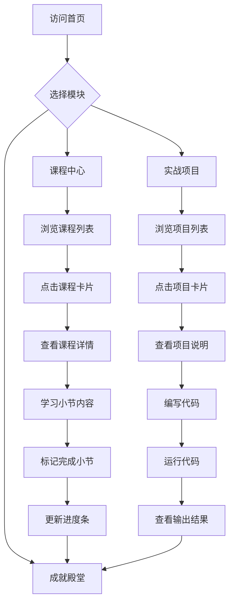

# 数析学院 - 产品需求文档

## 1. 产品概述

**数析学院**是一个专业的Python数据分析在线学习平台，采用VSCode风格深色主题，为用户提供沉浸式的数据分析学习体验。平台包含三大核心模块：课程中心、实战项目、成就殿堂，帮助用户从入门到进阶系统学习数据分析技能。

- 解决用户学习数据分析缺乏系统性教程的问题
- 提供真实数据集的在线编程实践环境
- 通过成就系统激励用户持续学习
- 目标用户：数据分析初学者、在职数据分析师、想转行数据领域的人员

## 2. 核心功能

### 2.1 用户角色

| 角色 | 注册方式 | 核心权限 |
|------|----------|----------|
| 访客 | 无需注册 | 浏览课程、项目、成就展示 |
| 学习者 | 模拟登录 | 保存学习进度、解锁成就、运行代码 |

### 2.2 功能模块

1. **全局导航栏**
   - Logo："数析学院"
   - 菜单项：首页、课程中心、实战项目、成就殿堂
   - 登录按钮（模拟功能）

2. **首页模块**
   - Hero区域：大标题 + 一句话介绍 + 开始学习按钮
   - 统计数据：课程数量(12)、项目数量(10)、学员数(模拟)
   - 推荐课程（3门热门课程卡片）
   - 推荐项目（3个热门项目卡片）
   - Footer

3. **课程中心模块**
   - 课程列表页：12门课程卡片网格展示
   - 课程详情页：左侧大纲 + 右侧学习内容
   - 每门课程至少6个小节
   - 进度保存到localStorage

4. **实战项目模块**
   - 项目列表页：10个项目卡片网格展示
   - 项目详情页：全屏两栏布局（40%文档 + 60%编辑器）
   - Pyodide在线Python运行环境
   - 真实数据集内嵌

5. **成就殿堂模块**
   - 成就卡片展示（已获得/未解锁）
   - 进度与成就联动

## 3. 核心流程

## 4. 用户界面设计

### 4.1 设计风格

- **主题**：VSCode深色主题
- **主色调**：纯黑背景 #0A0A0A
- **卡片背景**：深灰 #1E1E1E，带 #333 边框
- **主文字**：白色 #FFFFFF
- **次要文字**：浅灰 #B0B0B0
- **强调色**：亮蓝 #58A6FF
- **运行按钮**：绿色 #2C974B
- **代码背景**：#161B22
- **字体**：等宽字体用于代码，系统无衬线字体用于正文
- **图标风格**：Emoji图标

### 4.2 页面设计概览

| 页面 | 模块 | UI元素 |
|------|------|--------|
| 首页 | Hero区域 | 大标题、渐变文字、副标题、CTA按钮 |
| 首页 | 统计卡片 | 数字 + 标签，网格布局 |
| 首页 | 推荐区 | 卡片网格，悬停效果 |
| 课程中心 | 课程卡片 | 图标 + 标题 + 简介 + 进度条 |
| 课程详情 | 双栏布局 | 左侧大纲树 + 右侧内容区 |
| 实战项目 | 全屏两栏 | 文档区(40%) + 编辑器区(60%) |
| 成就殿堂 | 成就网格 | 徽章图标 + 名称 + 解锁状态 |

### 4.3 响应式策略

- **桌面优先**设计
- 断点：768px(平板)、480px(手机)
- 网格从多列变为少列
- 双栏布局在移动端变为单栏堆叠

## 5. 数据集需求

### 5.1 课程数据（12门课程）

| 课程ID | 课程名称 | 小节数 | 难度 |
|--------|----------|--------|------|
| python-basics | Python基础入门 | 8 | 入门 |
| data-types | 数据类型与运算 | 6 | 入门 |
| control-flow | 流程控制 | 6 | 入门 |
| functions | 函数与模块 | 6 | 入门 |
| pandas-intro | Pandas入门 | 8 | 入门 |
| data-cleaning | 数据清洗 | 6 | 进阶 |
| data-visualization | 数据可视化 | 6 | 进阶 |
| statistics | 统计分析基础 | 6 | 进阶 |
| sql-basics | SQL数据查询 | 8 | 入门 |
| machine-learning | 机器学习入门 | 6 | 高级 |
| time-series | 时间序列分析 | 6 | 进阶 |
| big-data | 大数据处理 | 6 | 高级 |

### 5.2 项目数据（10个项目）

| 项目ID | 项目名称 | 难度 | 时长 | 数据集 |
|--------|----------|------|------|--------|
| data-cleaning | 数据清洗实战 | 入门 | 30分钟 | retail_orders.csv |
| group-aggregate | 分组聚合分析 | 入门 | 30分钟 | retail_orders.csv |
| market-basket | 购物篮分析 | 进阶 | 45分钟 | market_basket.csv |
| customer-cluster | 客户聚类分析 | 进阶 | 45分钟 | customer_features.csv |
| data-viz | 数据可视化 | 进阶 | 45分钟 | retail_orders.csv |
| ab-test | A/B测试分析 | 进阶 | 45分钟 | ab_test.csv |
| time-series | 时间序列分析 | 进阶 | 45分钟 | time_series_sales.csv |
| feature-engineering | 特征工程 | 高级 | 60分钟 | customer_features.csv |
| anomaly-detection | 异常值检测 | 高级 | 45分钟 | customer_features.csv |
| multi-merge | 多数据集合并 | 进阶 | 45分钟 | retail_orders.csv + sales.csv |

### 5.3 成就数据

| 成就ID | 成就名称 | 解锁条件 |
|--------|----------|----------|
| first-course | 初学者 | 完成第1门课程 |
| five-courses | 五门课程 | 完成5门课程 |
| all-courses | 全能分析师 | 完成所有12门课程 |
| first-project | 实战新手 | 完成第1个项目 |
| five-projects | 项目达人 | 完成5个项目 |
| all-projects | 项目大师 | 完成所有10个项目 |
| streak-3 | 三天学习 | 连续学习3天 |
| streak-7 | 一周坚持 | 连续学习7天 |
| streak-30 | 一个月坚持 | 连续学习30天 |
| run-50 | 代码新手 | 累计运行50次 |
| run-100 | 代码达人 | 累计运行100次 |
| run-500 | 代码大师 | 累计运行500次 |

## 6. 技术约束

- 纯前端实现：HTML/CSS/JavaScript
- CSS框架：自定义CSS（不使用TailwindCSS，用户明确要求）
- 代码编辑器：轻量级textarea或简单实现
- Python运行：Pyodide CDN引入
- 数据持久化：localStorage
- 无需后端服务器
