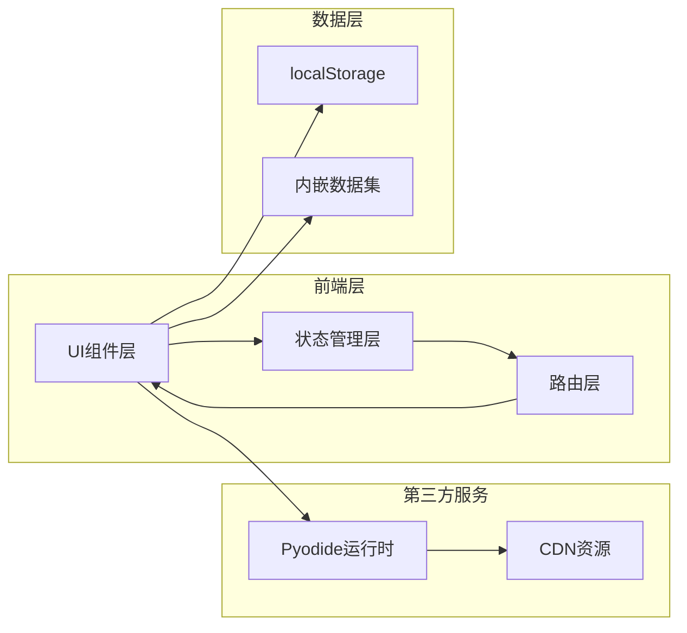

# 数析学院 - 技术架构文档

## 1. 架构设计



## 2. 技术选型

- **前端框架**：纯HTML/CSS/JavaScript（单页应用）
- **样式方案**：自定义CSS（VSCode深色主题）
- **路由方案**：Hash路由（#page形式）
- **状态管理**：原生JavaScript + localStorage
- **Python运行时**：Pyodide WebAssembly
- **代码编辑器**：自定义textarea实现
- **图表库**：可选（基础可视化）

## 3. 路由定义

| 路由 | 页面 | 描述 |
|------|------|------|
| #home | 首页 | Hero、统计、推荐 |
| #courses | 课程中心 | 课程列表 |
| #course/:id | 课程详情 | 课程大纲+内容 |
| #projects | 实战项目 | 项目列表 |
| #project/:id | 项目详情 | 文档+编辑器 |
| #achievements | 成就殿堂 | 成就展示 |

## 4. 数据结构定义

### 4.1 localStorage数据结构

```javascript
// 学习进度
{
  "courseProgress": {
    "python-basics": {
      "completedLessons": ["1.1", "1.2", "1.3"],
      "currentLesson": "1.4",
      "lastAccessed": "2024-01-15T10:30:00Z"
    }
  },
  "projectProgress": {
    "data-cleaning": {
      "completed": true,
      "lastAccessed": "2024-01-15T11:00:00Z"
    }
  },
  "codeRunCount": 42,
  "studyStreak": {
    "current": 3,
    "lastStudyDate": "2024-01-15"
  },
  "achievements": ["first-course", "five-projects"]
}
```

### 4.2 课程数据结构

```javascript
{
  id: "python-basics",
  title: "Python基础入门",
  icon: "🐍",
  description: "从零开始掌握Python编程",
  lessons: [
    {
      id: "1.1",
      title: "变量与数据类型",
      duration: "15分钟",
      type: "图文",
      content: {
        text: "详细讲解...",
        codeExamples: [
          { title: "示例1", code: "..." },
          { title: "示例2", code: "..." }
        ],
        tips: ["小贴士内容..."],
        commonErrors: ["常见错误..."]
      }
    }
  ]
}
```

### 4.3 项目数据结构

```javascript
{
  id: "data-cleaning",
  title: "数据清洗实战",
  icon: "🧹",
  difficulty: "入门",
  duration: "30分钟",
  dataset: "retail_orders.csv",
  description: "学习如何清洗真实零售数据",
  content: {
    objectives: ["目标1", "目标2"],
    datasetInfo: "数据集说明...",
    steps: ["步骤1", "步骤2"],
    codeExamples: [...],
    tips: [...],
    commonErrors: [...],
    challenges: [...]
  },
  starterCode: "import pandas as pd\n\n# 读取数据\ndf = pd.read_csv('retail_orders.csv')\nprint(df.head())"
}
```

## 5. 组件结构

```
├── index.html          # 主入口
├── css/
│   └── styles.css      # 全局样式
├── js/
│   ├── app.js         # 主应用逻辑
│   ├── router.js      # 路由管理
│   ├── store.js       # 状态管理
│   ├── data/
│   │   ├── courses.js # 课程数据
│   │   ├── projects.js# 项目数据
│   │   ├── datasets.js# 内嵌数据集
│   │   └── achievements.js # 成就数据
│   └── components/
│       ├── Navbar.js
│       ├── Footer.js
│       ├── CourseCard.js
│       ├── ProjectCard.js
│       ├── AchievementCard.js
│       ├── CodeEditor.js
│       └── PyodideRunner.js
```

## 6. Pyodide集成方案

### 6.1 CDN引入

```html
<script src="https://cdn.jsdelivr.net/pyodide/v0.24.1/full/pyodide.js"></script>
```

### 6.2 初始化流程

```javascript
async function initPyodide() {
  const pyodide = await loadPyodide({
    indexURL: "https://cdn.jsdelivr.net/pyodide/v0.24.1/full/"
  });
  await pyodide.loadPackage(["pandas", "numpy", "matplotlib"]);
  return pyodide;
}
```

### 6.3 数据集注入

```javascript
// 将CSV数据注入到Pyodide的文件系统中
pyodide.FS.writeFile('retail_orders.csv', csvDataString);
```

## 7. 页面布局规格

### 7.1 课程详情页

```
┌─────────────────────────────────────────────────┐
│                    导航栏                         │
├──────────────┬──────────────────────────────────┤
│              │                                  │
│   课程大纲    │         课程内容                  │
│   (30%宽度)   │         (70%宽度)                │
│              │                                  │
│   📚 1.1     │   标题                           │
│   ✓ 1.2     │   ────────────                   │
│   📚 1.3     │   文字讲解                        │
│   📚 1.4     │                                  │
│              │   代码示例1                        │
│              │   代码示例2                        │
│              │                                  │
│              │   💡 小贴士                       │
│              │   ⚠️ 常见错误                     │
└──────────────┴──────────────────────────────────┘
```

### 7.2 项目详情页（关键布局）

```
┌────────────────────────────────────────────────────────────────┐
│                         导航栏                                  │
├─────────────────────────────┬────────────────────────────────────┤
│                             │                                    │
│    项目说明文档 (40%)        │      在线代码编辑器 (60%)            │
│                             │                                    │
│    项目目标                  │   ┌────────────────────────────┐   │
│    ──────────               │   │  # Python代码编辑区         │   │
│    • 目标1                  │   │  import pandas as pd      │   │
│    • 目标2                  │   │  df = pd.read_csv(...)    │   │
│                             │   └────────────────────────────┘   │
│    数据集说明                │                                    │
│    ──────────               │   [ ▶ 运行代码 ]                    │
│    数据集介绍...             │                                    │
│                             │   输出区域                          │
│    分步骤指引                │   ┌────────────────────────────┐   │
│    ──────────               │   │  运行结果展示               │   │
│    1. 步骤1                 │   │  ...                       │   │
│    2. 步骤2                 │   └────────────────────────────┘   │
│                             │                                    │
│    代码示例                  │                                    │
│    小贴士                    │                                    │
│    常见错误                  │                                    │
│    挑战任务                  │                                    │
└─────────────────────────────┴────────────────────────────────────┘
```

## 8. 性能考虑

- 课程数据延迟加载
- Pyodide首次加载后缓存
- 数据集按需注入到Pyodide
- CSS和JS压缩
- 图片资源优化

## 9. 浏览器兼容性

- Chrome 80+
- Firefox 75+
- Safari 13+
- Edge 80+
